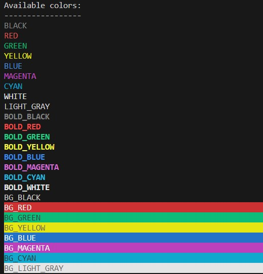

# changeTextColor

simple library-ish to change the text and or background in the terminal.  Tested in windows and linux.

# changeTextColor



changeTextColor_ is a cpp and .h for C++ library to print colored messages to the
terminal. It should be OS independent, written using ANSI escape code.
More info on the character codes can be found here under '3-bit and 4-bit':

https://en.wikipedia.org/wiki/ANSI_escape_code

Installation
------------
* Add ``changeTextColor.cpp`` and ``changeTextColor.h`` to your project 
* Compile example or your own code like this ``g++ main.cpp changeTextColor.cpp -o main``

How to use?
-----------
You can use the inlcluded functions or the color words themselves to output your desired text and background.
.. note::
  You may need to call the reset() function to clear unwanted colors
   

```cpp
#include <iostream>
#include "changeTextColor.h"

int main()
{
    // Test the color with normal white text
    reset();
    std::cout << "This is normal white text" << std::endl;

    // Test the color with normal red text
    setTextColor(RED, BLACK, "This is normal red text");

    std::cout << std::endl;
    std::cout << BOLD_BLUE << BG_RED << "This is normal blue text" << RESET << std::endl;
    setTextColor(BOLD_BLUE, BG_RED, "This is normal blue text");
    std::cout << std::endl;

    return 0;
}
```
```python
from changeTextColor import set_text_color, set_text_color_default, list_available_colors, underline, inverse, blink, reset

# Test the color with normal white text
reset()
print("This is normal white text")

# Test the color with normal red text
setTextColor(RED, BLACK, "This is normal red text")

print("\n")
print(BOLD_BLUE + BG_RED + "This is normal blue text")
setTextColor(BOLD_BLUE + BG_RED, "This is normal blue text")
print("\n")
```

## Color Options

### Colors

- `BLACK`
- `RED`
- `GREEN`
- `YELLOW`
- `BLUE`
- `MAGENTA`
- `CYAN`
- `WHITE`
- `LIGHT_GRAY`

### Bold Colors

- `BOLD_BLACK`
- `BOLD_RED`
- `BOLD_GREEN`
- `BOLD_YELLOW`
- `BOLD_BLUE`
- `BOLD_MAGENTA`
- `BOLD_CYAN`
- `BOLD_WHITE`
- `BOLD_LIGHT_GRAY`

### Background Colors

- `BG_BLACK`
- `BG_RED`
- `BG_GREEN`
- `BG_YELLOW`
- `BG_BLUE`
- `BG_MAGENTA`
- `BG_CYAN`
- `BG_LIGHT_GRAY`

### Extra

- `UNDERLINE`
- `BLINK`
- `RESET`
